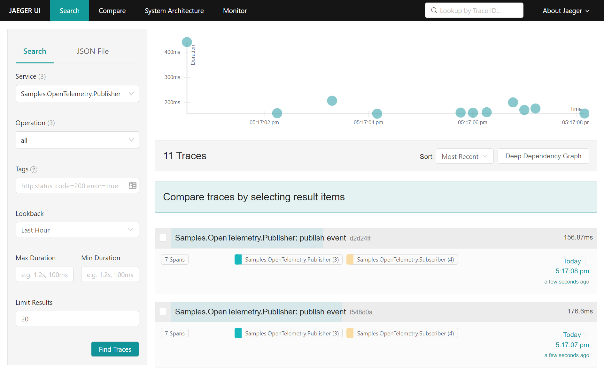
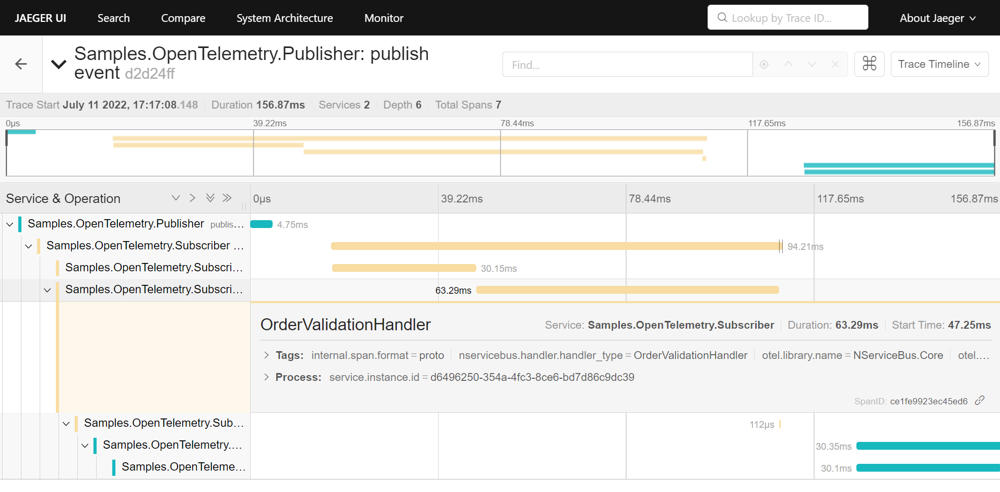

## Introduction

## Prerequisites

A Jaeger instance is required to send, process and view Open Telemetry trace diagnostics. Use the [`All in one` Jaeger container image](https://www.jaegertracing.io/docs/1.8/getting-started/#all-in-one) for development and testing purpose by running the following docker command:

```
$ docker run -d --name jaeger \
  -e COLLECTOR_ZIPKIN_HTTP_PORT=9411 \
  -p 5775:5775/udp \
  -p 6831:6831/udp \
  -p 6832:6832/udp \
  -p 5778:5778 \
  -p 16686:16686 \
  -p 14268:14268 \
  -p 9411:9411 \
  jaegertracing/all-in-one:1.8
```

With this default configuration, the Jaeger UI should be available at `http://localhost:16686`.

## Code overview

The sample contains two endpoints exchanging publish-subscribe events and point-to-point messages between each other. To enable tracing and export to Jaeger, the `TraceProvider` has to be configured like this:
each endpoint has to configure Open Telemetry:

snippet: jaeger-exporter-configuration

NServiceBus also needs to enable the OpenTelemetry instrumentation:

snippet: jaeger-endpoint-configuration

## Running the sample

Run the sample and press `1` on the `Publisher` endpoint to publish one or more events. Navigate to the Jaeger UI (by default at `http://localhost:16686`) to inspect the captured traces:



Inspecting a selected trace shows the conversation flow between the `Publisher` and the `Subscriber` endpoint:


