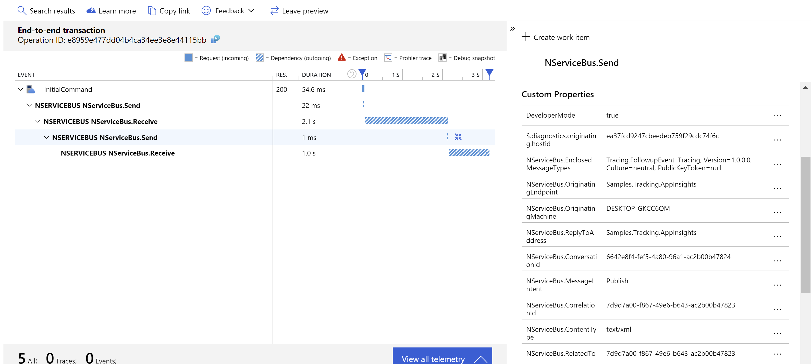

## Introduction

.NET Core 3.1 introduced support for distributed tracing. Types in the [System.Diagnostics](https://docs.microsoft.com/en-us/dotnet/api/system.diagnostics?view=dotnet-plat-ext-3.1) namespace may be used to expose and correlate execution data from a distributed system. This sample shows how to extend the NServiceBus pipeline with custom behaviors that publish trace data and how to send that data to [Azure Monitor Application Insights](https://docs.microsoft.com/en-us/azure/azure-monitor/app/app-insights-overview) for analysis and visualization.

## Running the sample

Running the sample requires an Application Insights resource. The [Instrumentation Key](https://docs.microsoft.com/en-us/azure/bot-service/bot-service-resources-app-insights-keys?view=azure-bot-service-4.0#instrumentation-key) must be provided by setting the `ApplicationInsightsKey` environment variable.

After starting the sample, pressing <kbd>Enter</kbd> sends an `InitialCommand`. When that command is handled, a `FollowUpEvent` is published. Trace data for both actions is pushed to Application Insights and available on the [transaction diagnostics](https://docs.microsoft.com/en-us/azure/azure-monitor/app/transaction-diagnostics#transaction-diagnostics-experience) pane:

NOTE: It may take [a couple of minutes](https://github.com/MicrosoftDocs/azure-docs/issues/14183) before the data is available on the dashboard.

## Code overview

### Pipeline behaviors

Trace data is exposed by custom pipeline behaviors. Each behavior defines a [DiagnosticSource](https://docs.microsoft.com/en-us/dotnet/api/system.diagnostics.diagnosticsource?view=netcore-3.1).

snippet: DiagnosticSourceDefinition

When a behavior is executed, if there is any listener subscribed to the source, an instance of [Activity](https://docs.microsoft.com/en-us/dotnet/api/system.diagnostics.activity?view=netcore-3.1) is created and started with the diagnostic source.

snippet: ActivityCreation

The new `Activity` inherits any existing tracing context (stored in `Activity.Current`), which initializes the `ParentId` property and links the new `Activity` to the parent `Activity`. Message headers are stored in the `Tags` collection to provide information about the specific message.

Finally, the activity ID is stored in the outgoing message header to allow the recipient to link its activities to those of the sender.

### Application Insights integration

Trace data produced by the behaviors is consumed by tracing listeners registered in `NServiceBusInsightsModule`:

snippet: TracingListenerRegistration

When an activity is started by a behavior, a listener is notified by its `OnNext` method. The activity is pushed to Application Insights using the `TelemetryClient` API:

snippet: ActivityProcessing
