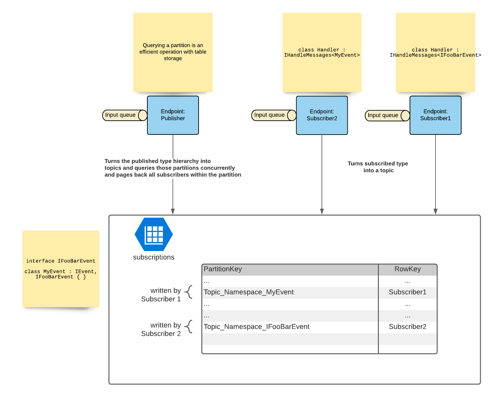
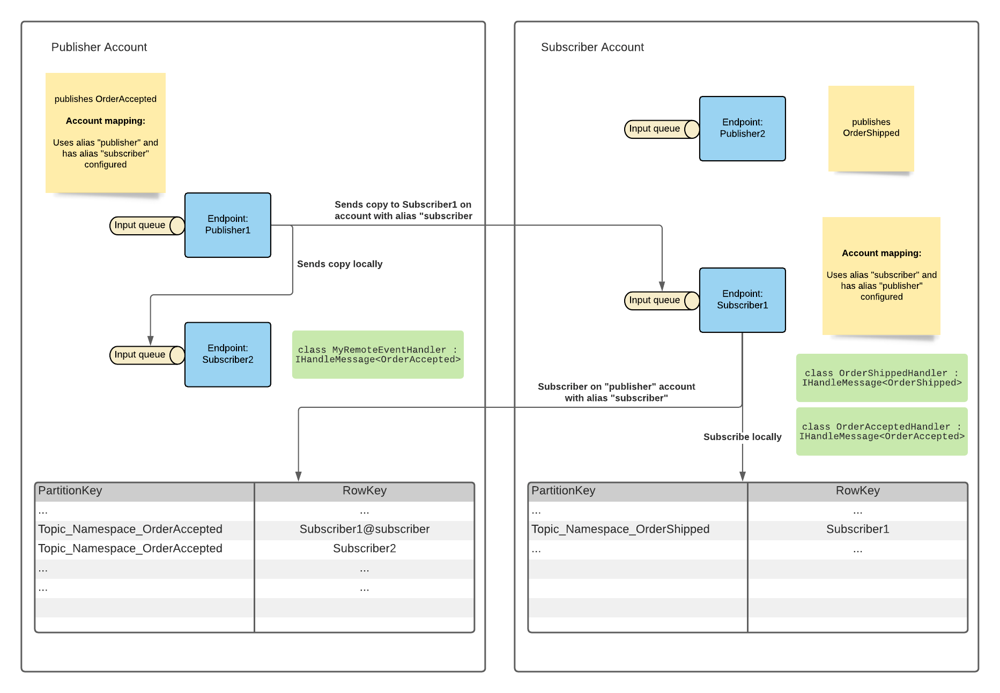

Azure Storage Queues implements the publish-subscribe pattern. In version 9 and below, this feature relies on message-driven pub-sub which requires a separate persistence for storage of subscription information. In version 10 and above, the transport handles subscription information natively and a separate persistence is not required.

The transport creates a dedicated subscription routing table, shared by all endpoints, which holds subscription information for each event type. 

When an endpoint subscribes to an event, an entry is created in the subscription routing table. 

When an endpoint publishes an event, the subscription routing table is queried to find all of the subscribing endpoints. Polymorphism is implemented on the publisher side by dissecting the published typed into its hierarchy and then reading all subscribers on those topics into a distinct list of queue addresses. By doing so, automatic deduplication on the hierarchy can be guaranteed.



All multi-cast operations are transformed into unicast operations to make sure multi-storage account support still works. 

### Multi storage account support

When the transport supported message-driven pub-sub, the multi-storage account support relied on the publisher information and the fact that the subscription messages were sent to the publisher queue. With the native pub-sub implementation, this approach no longer works. 

Multi-storage account support relies on an agreement of connectionstring information between publisher and subscriber. To keep this connection information secure the transport leverages the account alias metadata.

Using this alias metadata both subscriber and publisher can derive the connectionstring instead of storing it. This allows the subscriber to insert a subscription record into the subscription table on the publishers storage account with a queue address using only the subscriber alias.

Since publishers use unicast operations to send events to the subscriber queue directly, they always require the subscriber alias and the connection to be configured on the publisher side as well. 

When the publisher dispatches the unicast operations, it queries for the interested subscribers, which then returns local non-aliased subscribers together with remote, and hence aliased, subscribers.




The following endpoint configuration is required to make sure `Subscriber1` can subscribe to `OrderAccepted` and `Publisher1` can send the message. The publisher configuration

```csharp
transport.AccountRouting.DefaultAccountAlias = "publisher";

var anotherAccount = transport.AccountRouting.AddAccount("subscriber", ...);
anotherAccount.AddEndpoint("Subscriber1");
```

the subscriber configuration

```csharp
transport.AccountRouting.DefaultAccountAlias = "subscriber";

var anotherAccount = transport.AccountRouting.AddAccount("publisher", ...);
anotherAccount.AddEndpoint("Publisher1", new[] { typeof(OrderAccepted) }, "optionalSubscriptionTableName");
```