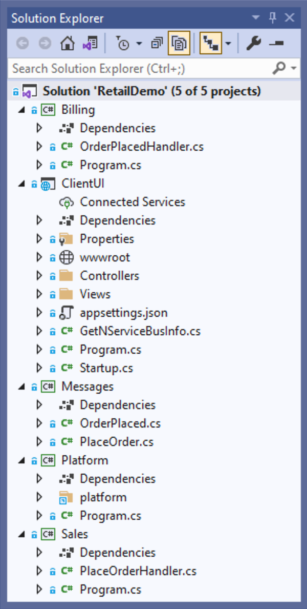
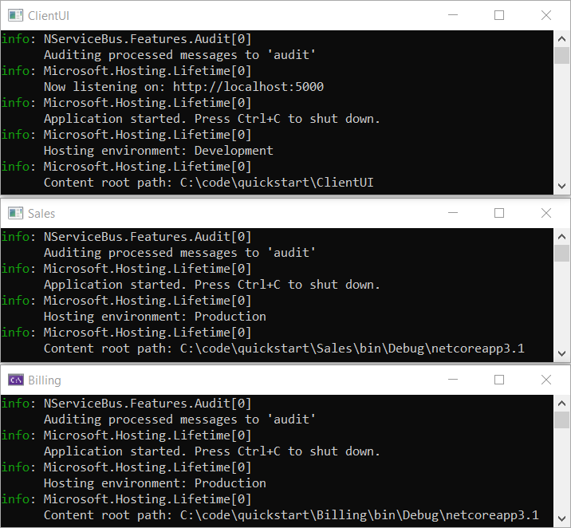
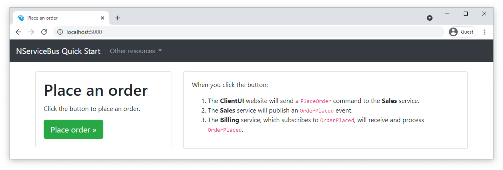
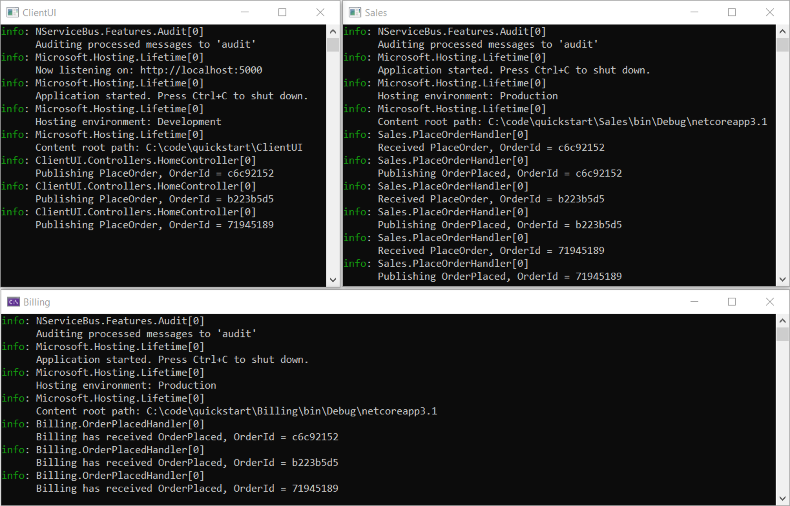

Want to learn what NServiceBus is all about? You're in the right place.

In less than an hour, the demo retail store project will show you how to:

* Connect different parts of a system using messages
* Build a failure-resistant system using messages
* Create a system that can be easily extended as new requirements are added

If you've already experienced the benefits of messaging, check out our [NServiceBus step-by-step tutorial](/tutorials/nservicebus-step-by-step/).

## Download demo

The demo solution doesn't require any prerequisites — no message queue or database to install, just Visual Studio. To get started, download the solution, extract the archive, and then open the **RetailDemo.sln** file.

downloadbutton

<style type="text/css">
  /* Remove borders on images as they all have appropriate borders */
  img.center { border-style: none !important; }
</style>

## Project structure

The solution contains five projects. The **ClientUI**, **Sales**, and **Billing** projects are [endpoints](/nservicebus/endpoints/) that communicate with each other using NServiceBus messages. The **ClientUI** endpoint is implemented as a web application and is the entry point to our system. The **Sales** and **Billing** endpoints, implemented as console applications, contain business logic related to processing and fulfilling orders. Each endpoint references the **Messages** assembly, which contains the definitions of messages as simple class files. The **Platform** project will provide a demonstration of the Particular Service Platform, but initially, its code is commented out.



As shown in the diagram below, the **ClientUI** endpoint sends a **PlaceOrder** command to the **Sales** endpoint. As a result, the **Sales** endpoint will publish an **OrderPlaced** event using the publish/subscribe pattern, which will be received by the **Billing** endpoint.


The solution mimics a real-life retail system where [the command](/nservicebus/messaging/messages-events-commands.md) to place an order is sent as a result of customer interaction, and the processing occurs in the background. Publishing [an event](/nservicebus/messaging/messages-events-commands.md) allows us to further isolate the code to bill the credit card from the code to place the order, reducing coupling and making the system easier to maintain over the long term. Later in this tutorial, we'll see how to add a second subscriber to that event in a new **Shipping** endpoint which will begin the process of shipping the order.

## Running the solution

The solution is configured to have [multiple startup projects](https://docs.microsoft.com/en-us/visualstudio/ide/how-to-set-multiple-startup-projects), so when we run the solution (**Debug** > **Start Debugging** or press <kbd>F5</kbd>) it should open three console applications, one for each messaging endpoint. One of these will open the web application in your browser. (The Particular Service Platform Launcher console app will also open but not do anything. Depending on your version of Visual Studio, it may persist or immediately close.)




{{WARNING: Did all three windows appear?
  - For [Visual Studio Code](https://code.visualstudio.com/) users, ensure the _Debug All_ launch configuration is selected from the dropdown list under the _Run and Debug_ tab.
  - In versions prior to Visual Studio 2019 16.1, there is a bug ([Link 1](https://developercommunity.visualstudio.com/content/problem/290091/unable-to-launch-the-previously-selected-debugger-1.html), [Link 2](https://developercommunity.visualstudio.com/content/problem/101400/unable-to-launch-the-previously-selected-debugger.html?childToView=583221#comment-583221)) that will sometimes prevent one or more projects from launching with an error message. If this is the case, stop debugging and try again. The problem usually happens only on the first attempt.}}

In the **ClientUI** web application, click the **Place order** button to place an order, and watch what happens in other windows.

It may happen too quickly to see, but the **PlaceOrder** command will be sent to the **Sales** endpoint. In the **Sales** endpoint window we see:

```
INFO Received PlaceOrder, OrderId = 9b16a5ce
INFO Publishing OrderPlaced, OrderId = 9b16a5ce
```

As shown in the log, the **Sales** endpoint then publishes an **OrderPlaced** event, which will be received by the **Billing** endpoint. In the **Billing** endpoint window we see:

```
INFO Billing has received OrderPlaced, OrderId = 9b16a5ce
```

In the **ClientUI** web application, go back and send more messages, watching the messages flow between endpoints.



## Up next

Now that the project is up and running, let's break it!
